I'll go over the class's PvE and PvP strengths and weaknesses in a short summary. After that, feel free to explore the sub-sections below for advice on making your Templar shine in the early-to-mid game — by the time you reach end game you should have enough knowledge to fine-tune the build for yourself.

## PvE

**Pros**

- The one and only tank in the game.
  - Templar can take aggro, pull mobs, provide ATK buffs via passives, and provide shields via passives and skills.
  - Relatively safe and easy progression from level 1 to 45.
- Easier to get into party content due to the lack of tank players.

**Cons**

- You have to keep threat generation in mind — you can't just randomly press buttons. If a DPS pulls aggro, it usually points to a rotation issue, unless they simply have a lot more Gear Score than you.
- Solo farming or clearing certain daily/weekly bosses can be slower and more painful.
  - For solo farming in the open world, your best friend is **Poach** with the instant cooldown-reduction add-on — it refreshes on cooldown when the target dies to you. If someone else last-hits the mob, you won't get the refresh, so plan your pulls around that. Killing a mob nearby also refreshes the cooldown.
  - Daily/weekly dungeons require careful attention to mechanics so you don't lose even more of the DPS you're already short on.

## PvP

**Pros**

- Best 1v1 kit you can ask for.
  - CC (3x stuns, stagger, knockdown, 2x pull/grab), damage reduction, shield buffs, dashes (x2), CC resist, 3x uses of Shield Block (insane), high HP & defense, and add-ons providing small heals.
- Has two roles in large-scale PvP: **Frontline Tank** (survive and disrupt) and **Backline Peeler** (disrupt).
  - The roles mirror TnL. It's unclear how well a hybrid works, but if you've played TnL tanks, you'll recognize Blood Devotion here too — potentially the biggest strength for a Backline Peeler. Use it carelessly while your healer/DPS is under heavy pressure and you can accidentally kill them both, so stick to regular CC and shield buffs unless you're sure.

**Cons**

- Can be kited by ranged classes fairly easily.
  - You need to know other classes by heart to perform well against them — for example, when to use a CC break versus Shield of Protection to mitigate burst ("bomba") skills.
- Requires a team-first mindset — you can't play egoistically. Your entire job is leading the group (shotcalling or engaging fights) and peeling for your team.

## Daevanion pathing

Early-mid game Daevanion pathing (optimal point investing). For each Daevanion below, start with either the Green or Orange path shown.

### Nezekan

Start with either Green or Orange pathing.

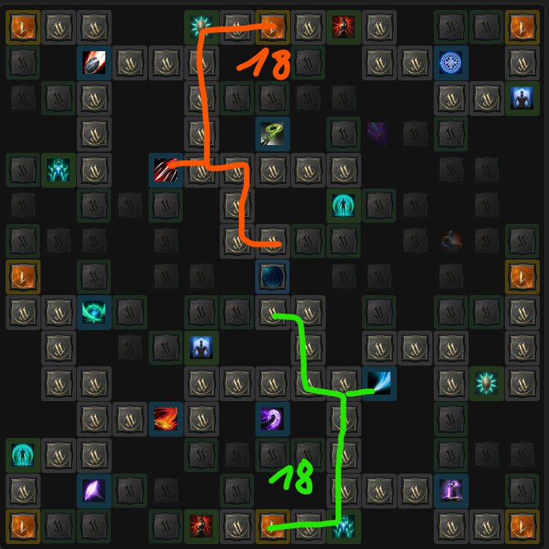

### Zikel

Start with either Green or Orange pathing.

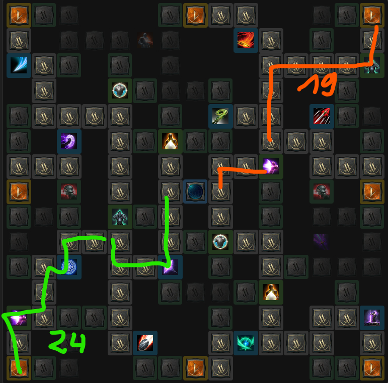

### Vaizel

Start with either Orange or Green pathing.

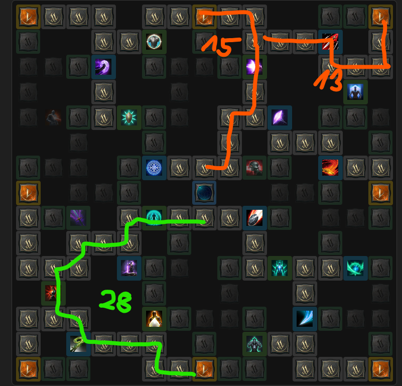

### Triniel

Start with either Green or Orange pathing.

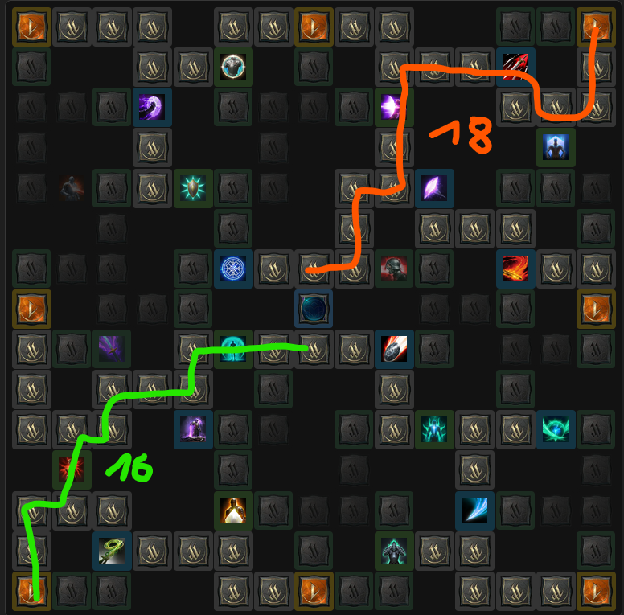

### Ariel

Start with either Green or Orange pathing.

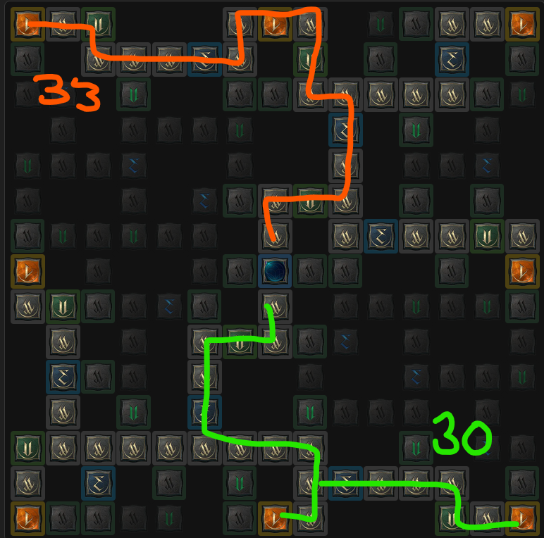

### Azphel

Singular path.

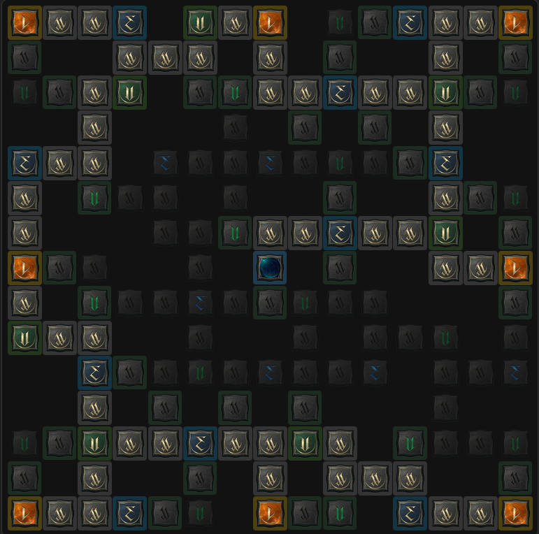

## Gear

Gear priorities below assume the base kit obtainable from your questlog.

### PvE gear

| Slot | Priority stats |
| --- | --- |
| Chest piece | DMG Boost, Endurance, Critical Hit, +1 passive/skill (Ironclad or Enhance Health) |
| Gloves | Combat Speed, Perfect Chance, Critical Hit, +1 passive/skill (Ironclad or Enhance Health) |
| Boots | Movement Speed, Perfect Chance, ATK, +1 passive/skill (Ironclad or Enhance Health) |
| Shoulders | Crit DMG Boost, Endurance, ATK, +1 passive/skill (Ironclad or Enhance Health) |
| Helmet | Smite, ATK increase, Endurance, +1 passive/skill (Ironclad or Enhance Health) |
| Pants | Perfect Chance, ATK increase, ATK, Endurance |
| Cloak | Smite, ATK increase, Perfect Chance, +1 passive/skill (Ironclad or Enhance Health) |
| Necklace | Intelligence, 3x +1 passive/skill (Ironclad, Enhance Health or Impact Hit) |
| Rings | Intelligence, 3x +1 passive/skill (Pummel, Vicious, Defiance) |
| Bracelets | Wisdom, Time, Destruction, Freedom |

### PvP gear

| Slot | Priority stats |
| --- | --- |
| Chest piece | DMG Boost, Status Effect Resist, Endurance, +1 passive/skill (Ironclad or Enhance Health) |
| Gloves | Combat Speed, Status Effect Resist, Willpower, +1 passive/skill (Ironclad or Enhance Health) |
| Boots | Movement Speed, Status Effect Resist, Willpower, +1 passive/skill (Ironclad or Enhance Health) |
| Shoulders | Willpower, Status Effect Resist, Endurance, +1 passive/skill (Ironclad or Enhance Health) |
| Helmet | Endurance, Status Effect Resist, Willpower, Endurance, +1 passive/skill (Ironclad or Enhance Health) |
| Pants | Endurance, Status Effect Resist, Willpower, Damage Tolerance |
| Cloak | Status Effect Resist, Willpower, Critical Damage Tolerance, +1 passive/skill (Ironclad or Enhance Health) |
| Necklace | Intelligence, 3x +1 passive/skill (Ironclad, Enhance Health or Impact Hit) |
| Rings | Intelligence, 3x +1 passive/skill (Pummel, Vicious, Defiance) |
| Bracelets | Wisdom, Time, Destruction, Freedom |

### Reasoning

DPS players can easily reach 70% Smite and above 80% Perfect Chance — near impossible to counter both at once (this is worse on TW & KR than on Global, but still high enough that we can't fully build around it).

It's possible to build enough Critical Damage Tolerance just from the cape stat alone. The only real counter to the Smite meta is stacking enough Time stat — realistically we can only reach around 28.4% Smite Resistance.

## Pantheon

Justice, Space, Time, Destiny, Destruction, Wisdom and Freedom are the best Pantheon stats for Templar.

**Statues (4 max)**

- **Green:** Gatekeeper Pinpio (Nightmare shop), Furious Feruk (Nightmare shop), Grisilla (MSQ)
- **Blue:** Fortress Guardian (Nightmare shop), Eltnen's Flower (Battle pass), Morheim's Flower (Battle pass)

**Artwork (12, Wisdom & Destiny)**

- **Blues:** Nornird Assembly (Nnyerk Shooter 10x + Picture Frame 10x, Shugo Festival), Quai Campsite (Goldrin's Treasure 10x + Picture Frame 10x, Shugo Festival), Sanctum Outpost (Mysterious Track 10x + Picture Frame 10x, Shugo Festival), Dredgion Crash Site (Jump Jump 10x + Picture Frame 10x, Shugo Festival), Morheim (Battle pass), Eltnen (Battle pass), Mad Watcher Bulagan (Field Boss II, 1000x), Azure Tear Glacia (Field Boss II, 1000x), Elite Inquisitor (Field Boss II, 1000x), Frostarmor (Field Boss II, 1000x), Edgewalker (Field Boss II, 1000x), Veteran Shujakan (Field Boss I, 1000x), Special Operation (Field Boss I, 1000x), High Overseer (Field Boss I, 1000x), Blue Wave Kelpina (Field Boss I, 1000x), Deceiver Trid (Field Boss I, 1000x)
- **Heroic:** Immortal Gartua (Field Boss I, 20000x)
- **Unique:** Cradle of Nihility, Ferocious Horn Den, Krao, Fire Temple, Silent Dartan (Field Boss I, 5000x), Desecrator Newbold (Field Boss I, 5000x), Drakan Battalion (Field Boss I, 5000x), Soul Ruler (Asmodian Field I bosses, 5000x drop)

## Arcana

There will be only two Arcana sets at launch — Templar benefits from the first set for now.

### Primal Vigor

- **Set 2:** +60 PvE Attack when HP is 70% or more
- **Set 4:** +150 PvE Attack when HP is 70% or more

This is our main set for now. Build order recommendation: **Bell → Chalice → Compass → Parchment**.

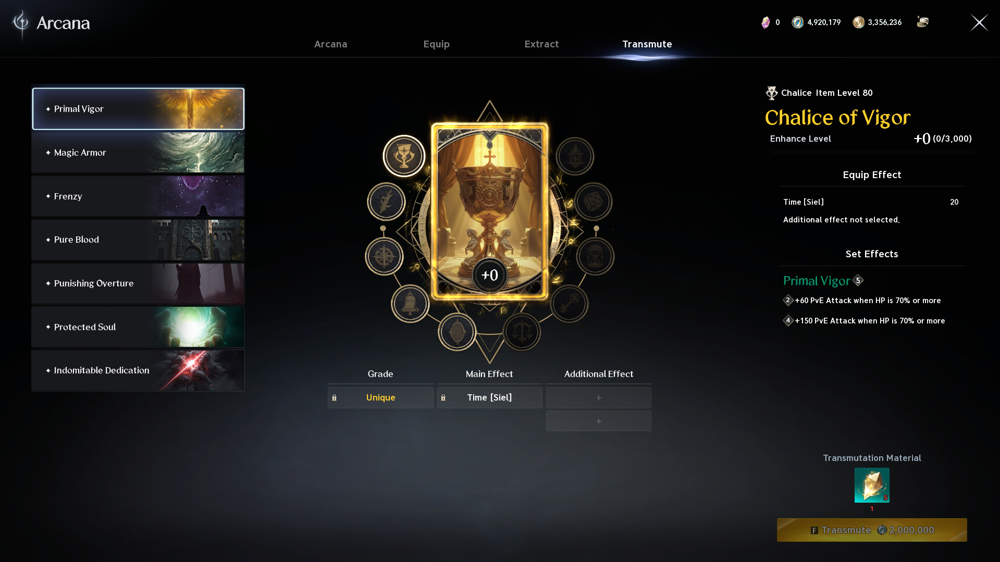

### Magic Armor

What we want from this set is the **Mirror**, which grants Wisdom.

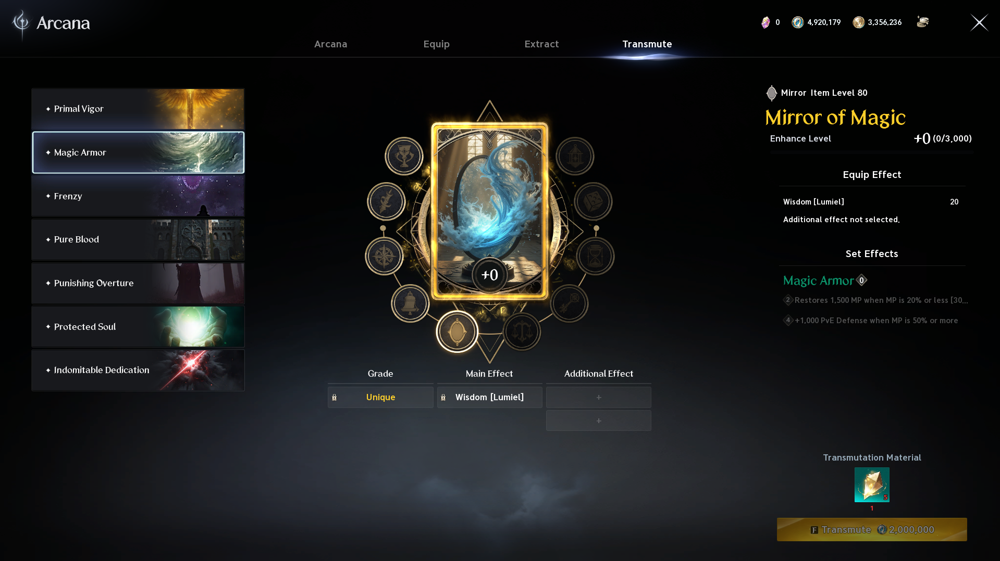

## Wings

### PvE Wings

- **Forest Spirit Wings** — Conquest: Vakron Sky Island 50x, Radiant Odyle 10x

  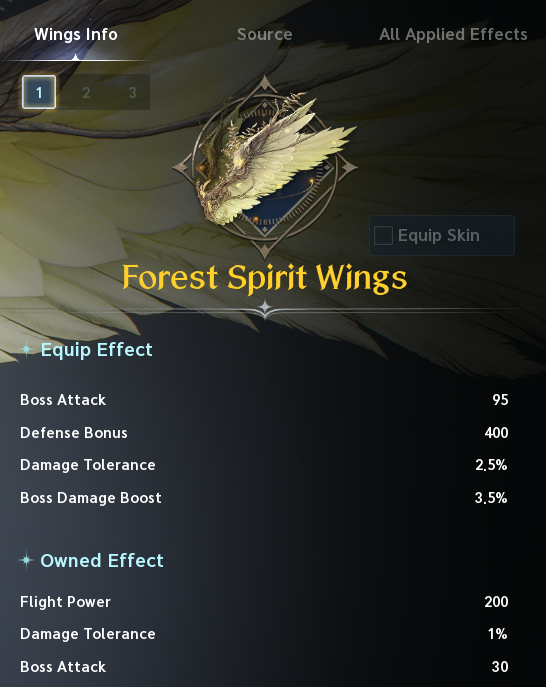

- **Dark Veil Wings** — Conquest: Dark Veil 50x, Radiant Odyle 10x

  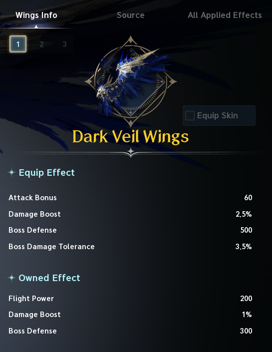

- **Nightmare Wings** — 160,000 Nightmare points

  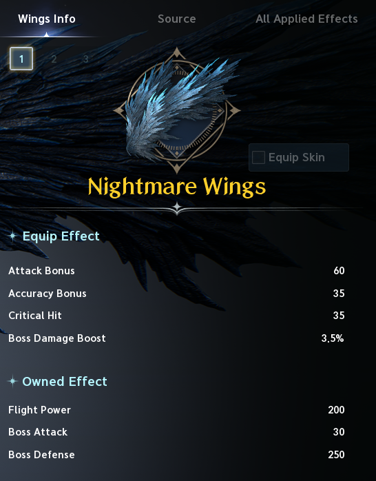

- **Dramata Nest Wings** — Conquest: Dramata Nest 50x, Radiant Odyle 10x

  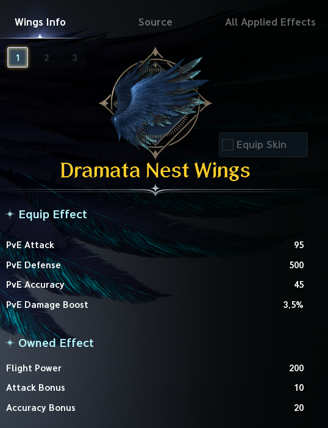

### PvP Wings

- **Azure Flash Wings** — Conquest: Azure Breath Island 50x, Radiant Odyle 10x

  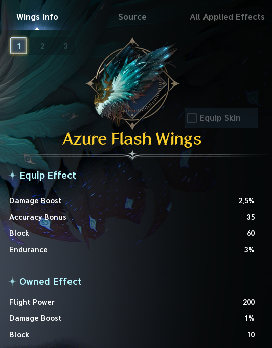

- **Brawler Wings** — 800,000 Abyss Points. The best option we can use, but very expensive.

  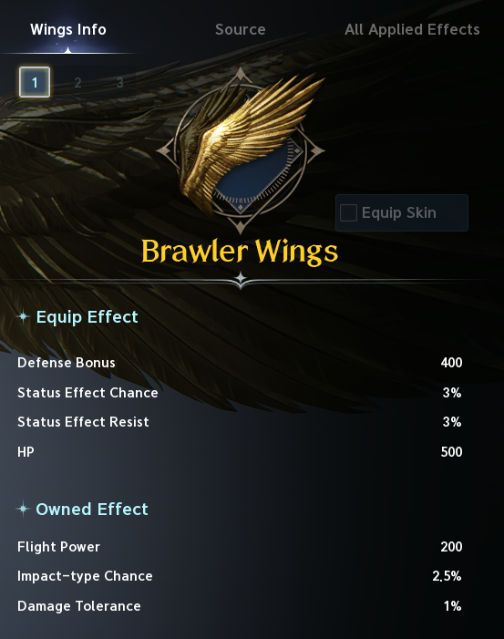

- **Talisra Wings** — Season Store, 210,000 Abyss Points

  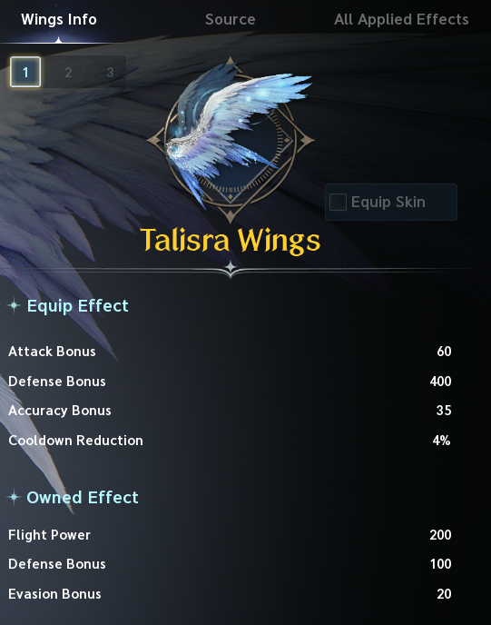

## Pets

Each time you kill a monster that has a soul, you get it. Every pet starts at level 0, and each soul dropped raises its level from 0 up to level 5. Each level gives a bonus to the character — faster mount movement, more health, more evasion, and so on.

**Pet farming thresholds:**

- Unlock lvl 1 — kill 1
- Unlock lvl 2 — kill 15
- Unlock lvl 3 — kill 50
- Unlock lvl 4 — kill 100
- Unlock lvl 5 — kill 180

Genus insight also starts at level 0 and goes up to level 10 max. At lower levels you only get gray and green bonuses; blue bonuses appear later, and unique/heroic bonuses show up in the later stages.

The goal is to keep leveling your Genus insight until it hits level 10, then start rerolling the stats — don't lock in random blue/unique upgrades early.

**Target Genus layout:**

| Cogni | Fera | Natura | Varian | Special |
| --- | --- | --- | --- | --- |
| Accuracy / Crit | Accuracy / Crit | Accuracy / Crit | Accuracy / Crit | Attack bonus |
| Attack bonus | Attack bonus | Attack bonus | Attack bonus | Attack bonus |
| Smite | Smite | Smite | Smite | Smite |
| Accuracy / Crit | Accuracy / Crit | Accuracy / Crit | Accuracy / Crit | Attack bonus |
| Attack bonus | Attack bonus | Attack bonus | Attack bonus | Attack bonus |
| Endurance | Endurance | Endurance | Endurance | Endurance |
| Accuracy / Crit | Accuracy / Crit | Accuracy / Crit | Accuracy / Crit | Attack bonus |
| Attack bonus | Attack bonus | Attack bonus | Attack bonus | Attack bonus |
| Smite | Smite | Smite | Smite | Smite |

Rolling it perfectly in every slot is nearly impossible — sometimes you'll need to compromise.

## Skill builds

- [PvE Mob grinder](https://questlog.gg/aion-2/en/skill-builder/ssbhocXcpUCO?build-id=4450)
- [PvE Dungeon grinder](https://questlog.gg/aion-2/en/skill-builder/ssbhocXcpUCO?build-id=3415)
- [PvP Arena](https://questlog.gg/aion-2/en/skill-builder/ssbhocXcpUCO?build-id=4451)
- [PvP Large Scale, Frontliner (engager, survivor)](https://questlog.gg/aion-2/en/skill-builder/ssbhocXcpUCO?build-id=4452)
- [PvP Large Scale, Backliner (peeler)](https://questlog.gg/aion-2/en/skill-builder/ssbhocXcpUCO?build-id=4454)
- [PvP Large Scale, Diver](https://questlog.gg/aion-2/en/skill-builder/ssbhocXcpUCO?build-id=4637)

## Combat settings

- **PvE:** 75% HP auto-use potion
- **PvP:** 90% HP auto-use potion

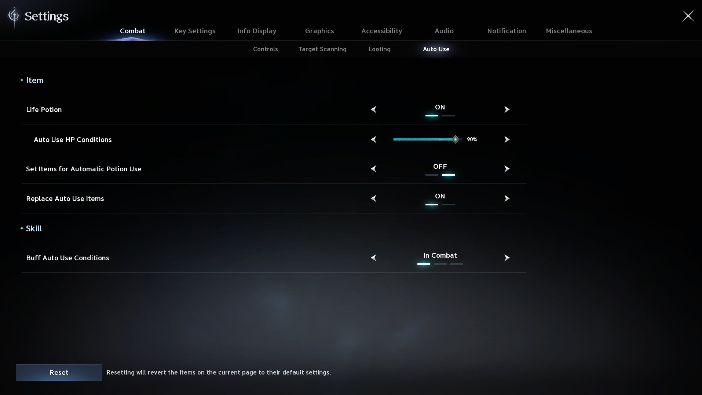

## Targeting

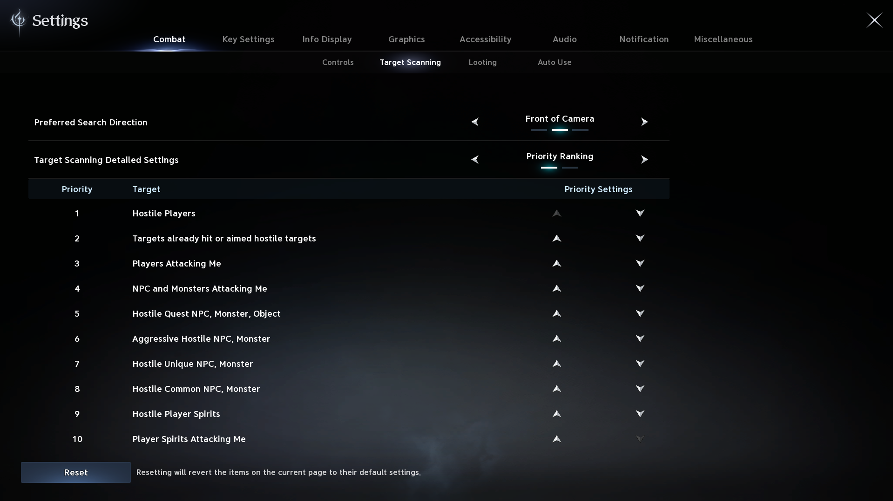

## Macro settings

- **[PvE Mob grinder](https://questlog.gg/aion-2/en/skill-builder/ssbhocXcpUCO?build-id=4450)**

  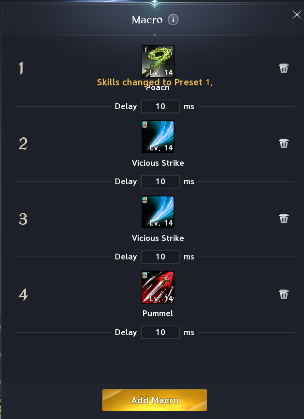

- **[PvE Dungeon grinder](https://questlog.gg/aion-2/en/skill-builder/ssbhocXcpUCO?build-id=3415)**

  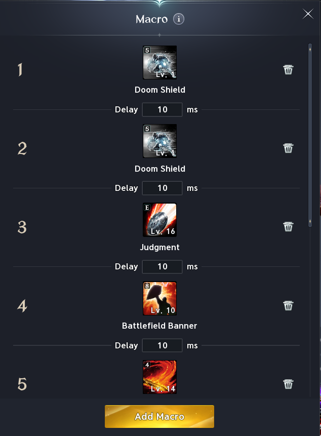

  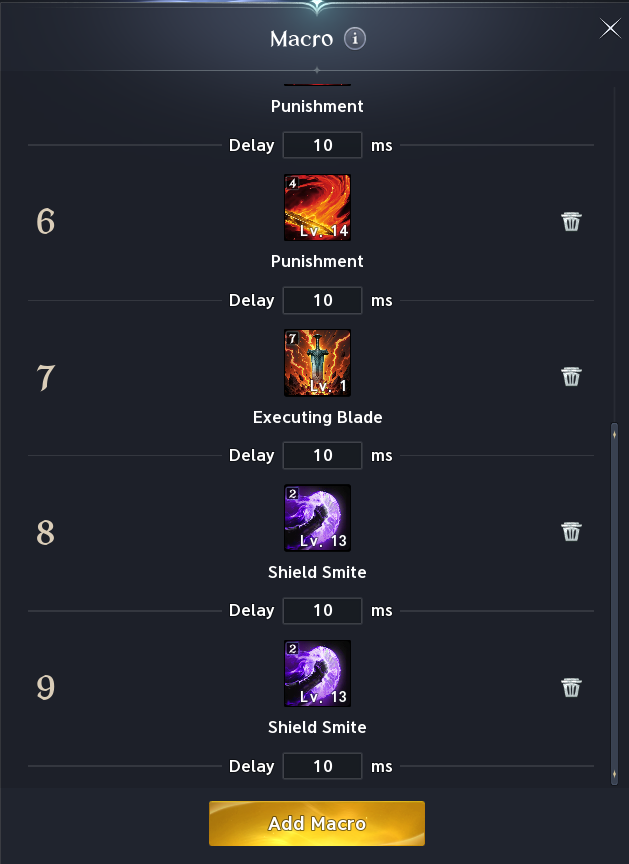

- **[PvP Large Scale, Frontliner (engager, survivor)](https://questlog.gg/aion-2/en/skill-builder/ssbhocXcpUCO?build-id=4452)**

  Anything else I do manually — I mainly use this macro to engage.

  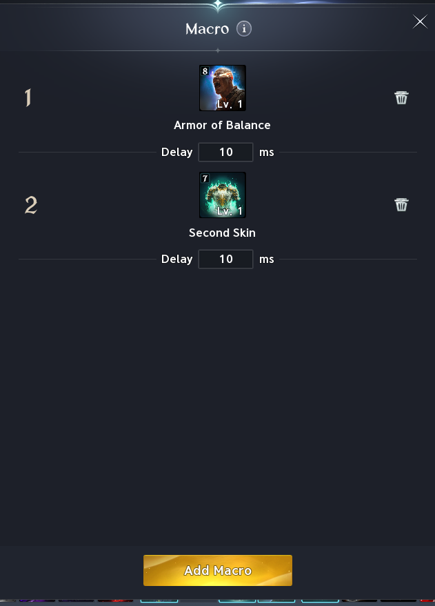

- **[PvP Large Scale, Backliner (peeler)](https://questlog.gg/aion-2/en/skill-builder/ssbhocXcpUCO?build-id=4454)**

  Pull a group of enemies and taunt them, increase their damage tolerance and decrease their attack, then stun them (hopefully, depending on their CC resistance).

  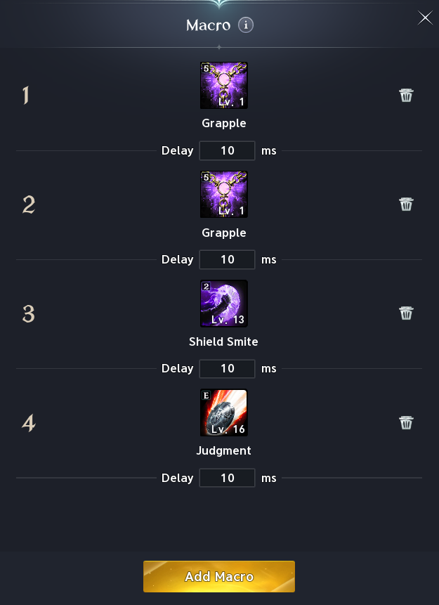

- **[PvP Large Scale, Diver](https://questlog.gg/aion-2/en/skill-builder/ssbhocXcpUCO?build-id=4637)**

  Assault Fury, Taunt, Banner, Shield Smite AoE stun, AoE Judgment into Punishment.

  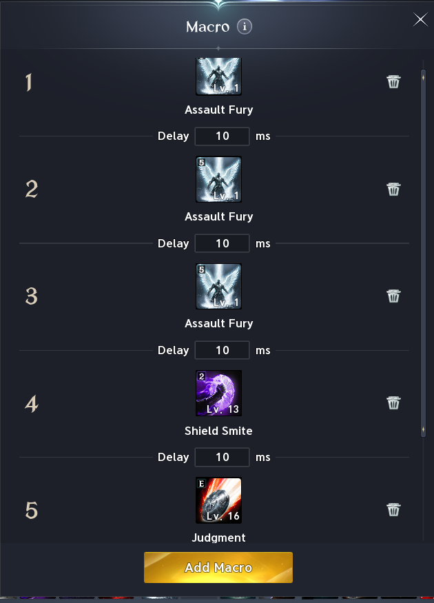
